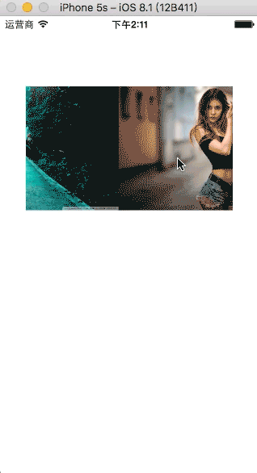

  

# 使用方法
    引入#import "RunView.h"
    self.runView.delegate = self;
    NSArray * images = @[[NSURL fileURLWithPath:BundleSource(@"p1", @"jpg")],
                         [NSURL fileURLWithPath:BundleSource(@"p2", @"jpg")],
                         [NSURL fileURLWithPath:BundleSource(@"p3", @"jpg")],
                         ];
    self.runView.imageUrlArray = images;
    self.runView.autoScrollTime = 4;
    [self.runView startAutoScroll];
# 说明
  RunView 使用到第三方类库 SDWebImage 如项目中已经集有此类库，则不需要重复添加SDWebImage文件夹下的文件
